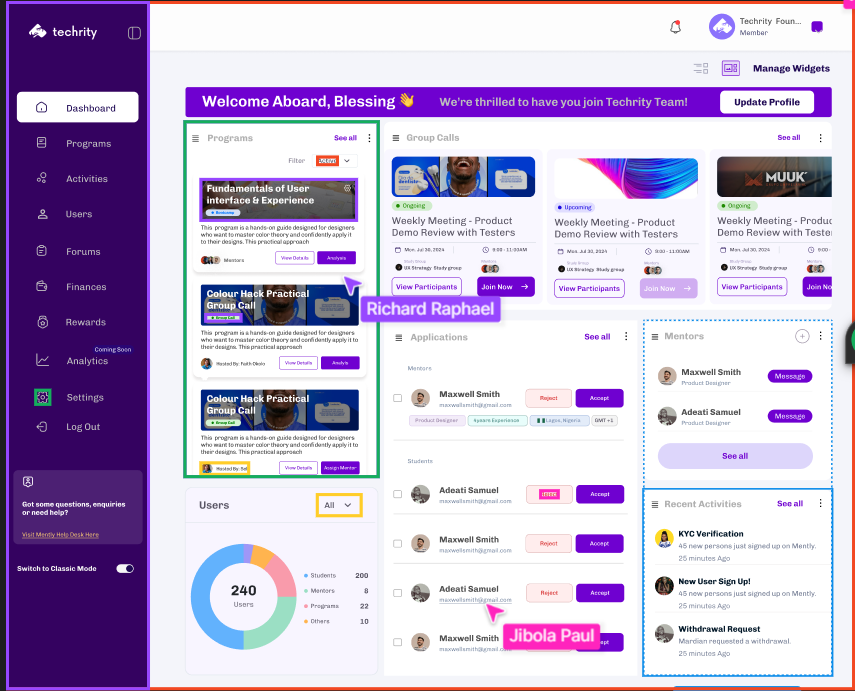

# Techrity Dashboard

A modern, responsive dashboard interface for the Techrity platform built with Next.js and Tailwind CSS.




## Features

- 🎨 Modern UI with purple theme and clean design
- 📱 Fully responsive layout for all device sizes
- 🧩 Component-based architecture using shadcn/ui
- 📊 Interactive charts with Recharts
- 🔄 Real-time data visualization
- 🌙 Light/dark mode support
- 🔐 User management interface


## Tech Stack

- **Framework**: Next.js 14 (App Router)
- **Styling**: Tailwind CSS
- **Components**: shadcn/ui (Radix UI + Tailwind)
- **Icons**: Lucide React
- **Charts**: Recharts
- **Language**: TypeScript


## Getting Started

### Prerequisites

- Node.js 20.x
- npm


### Installation

1. Clone the repository:

```shellscript
https://github.com/idungstanley/mently-frontend-test.git
cd mently-frontend-test
```


2. Install dependencies:

```shellscript
npm install
```


3. Run the development server:

```shellscript
npm run dev
```

4. Open [http://localhost:3000](http://localhost:3000) in your browser to see the dashboard.


## Project Structure

```plaintext
mently-frontend-test/
├── app/                  # Next.js App Router
│   ├── layout.tsx        # Root layout
│   ├── page.tsx          # Home page
│   └── globals.css       # Global styles
├── components/           # React components
│   ├── dashboard.tsx     # Main dashboard layout
│   ├── sidebar.tsx       # Navigation sidebar
│   ├── welcome-header.tsx # Welcome section
│   ├── programs-section.tsx # Programs display
│   ├── group-calls-section.tsx # Group calls display
│   ├── applications-section.tsx # Applications management
│   ├── mentors-section.tsx # Mentors display
│   ├── recent-activities-section.tsx # Activity feed
│   ├── users-section.tsx # User statistics with chart
│   ├── mobile-header.tsx # Mobile navigation header
│   └── ui/               # shadcn/ui components
├── hooks/                # Custom React hooks
│   └── use-media-query.tsx # Responsive design hook
├── lib/                  # Utility functions
│   └── utils.ts          # Helper utilities
├── public/               # Static assets
└── tailwind.config.ts    # Tailwind configuration
```

## Key Components

- **Dashboard**: Main layout container for the entire application
- **Sidebar**: Navigation menu with links to different sections
- **Programs Section**: Displays available educational programs
- **Group Calls Section**: Shows upcoming and ongoing video meetings
- **Applications Section**: Manages user applications with approve/reject functionality
- **Users Section**: Visual representation of user statistics with pie chart
- **Mentors Section**: Lists available mentors with contact options
- **Recent Activities Section**: Timeline of recent platform activities


## Customization

### Theming

The dashboard uses a custom purple theme. You can modify the colors in:

1. `app/globals.css` - For CSS variables used by shadcn/ui components


### Adding New Sections

To add a new section to the dashboard:

1. Create a new component in the `components/` directory
2. Import and add it to the grid layout in `components/dashboard.tsx`


## Deployment

This project can be deployed on Vercel with zero configuration:

[

](https://vercel.com/new/clone?repository-url=https://github.com/idungstanley/mently-frontend-test.git)

## License

[MIT](LICENSE)

## Acknowledgements

- Design inspiration from Techrity's original dashboard
- [shadcn/ui](https://ui.shadcn.com/) for the component library
- [Lucide React](https://lucide.dev/) for the beautiful icons
- [Recharts](https://recharts.org/) for the data visualization


---
